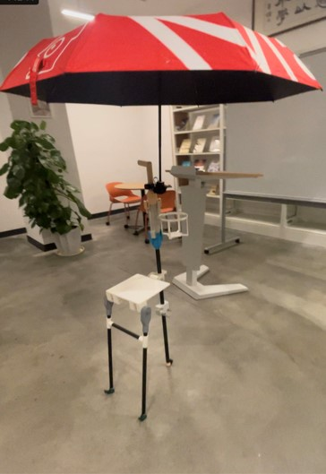

# ME 270 - Design for Manufacturability at ZJUI (Fall 2022)

## Introduction
This repository contains the CAD files for the **The Versatile Shelter** project completed during the ME 270 course at the Zhejiang University-University of Illinois Urbana-Champaign Institute (ZJU-UIUC).

  
  

## Features:
- **Load Capacity**: Supports up to 70 kg, ensuring stability and safety for users.
- **Modular Design**: Allows for easy assembly, disassembly, and adaptation to multiple functionalities.
- **Lightweight and Portable**: Made with carbon fiber and optimized for portability without compromising strength.
- **Integrated Umbrella Holder**: Provides a hands-free solution to keep users dry in rainy conditions.
- **Durable and Reliable**: Designed with high-quality materials to withstand regular use while remaining lightweight.

## Authors
This project was designed and manufactured by:
- **Qingran WU**
- **Yanbo CHEN**
- **Sicheng LU**
- **Zhiliang HE**
